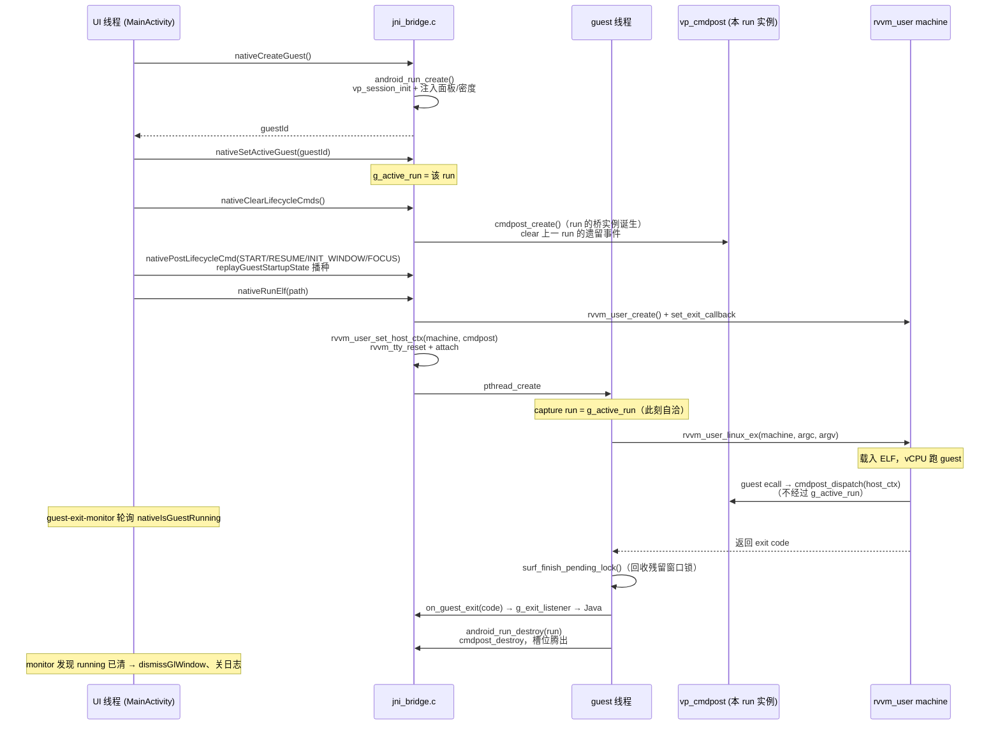
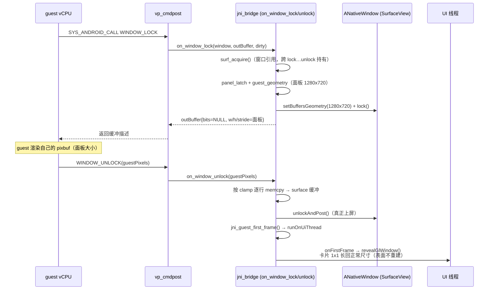
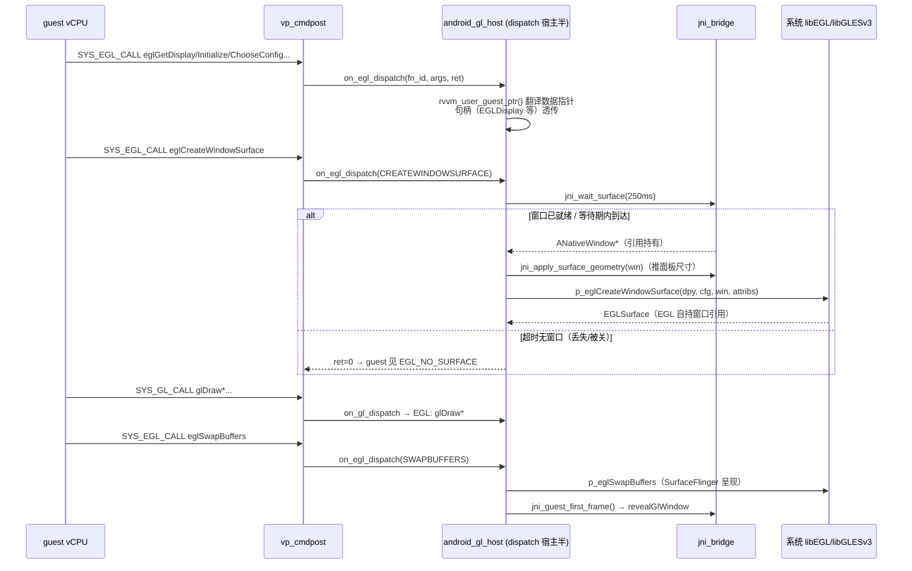
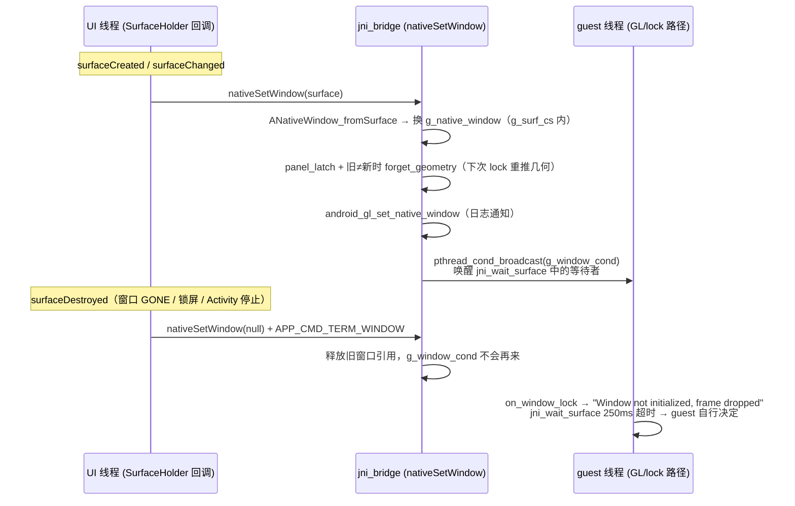

# RVVM Android Host 架构

本文描述 `src/virtpass/android-host` 的整体架构：Java Activity、JNI 桥、vp_cmdpost 桥接层、
rvvm_user 核心与 guest 侧 NDK stub 如何协作，重点覆盖 **渲染管线** 与 **多 machine 实例 + 多 run**
架构（大体实现、尚未完整应用）。

```
┌────────────────────────────────────────────────────────────────────┐
│ MainActivity.java (com.rvvm.android)                               │
│  - SurfaceView 浮动图形窗口（卡片，可拖动/最小化/最大化/关闭）          │
│  - TextureView TTY 控制台（libvterm 快照渲染 + 键盘输入）              │
│  - SurfaceHolder.Callback → nativeSetWindow / lifecycle cmd         │
│  - 触摸 → nativePostMotionEvent（卡片像素 → 面板像素线性映射）          │
└───────────────┬────────────────────────────────────────────────────┘
                │ JNI (RvvmNative)
┌───────────────▼────────────────────────────────────────────────────┐
│ jni_bridge.c                                                        │
│  - struct android_run × N（多 run 表 + g_active_run）                │
│  - 全局窗口 g_native_window + g_surf_cs（窗口属于宿主，不属于 run）     │
│  - vp_cmdpost 回调注册 / 窗口 lock/unlock / GL dispatch 宿主半        │
│  - TTY JNI 面（snapshot/resize/serial/scroll/input）                 │
└───────┬───────────────────────────────┬─────────────────────────────┘
        │ vp_cmdpost_t* (每 run 一个)    │ rvvm_user API
┌───────▼───────────────┐   ┌───────────▼─────────────────────────────┐
│ vp_cmdpost.c (桥)      │   │ rvvm_user.c (RISC-V userland 核心)       │
│  host↔guest 队列/回调   │◄──┤  - rvvm_user_create() 每 run 一个 machine │
│  SYS_ANDROID_CALL 分发  │   │  - rvvm_user_linux_ex() 载入 ELF 并跑 vCPU│
│  SYS_GL/EGL_CALL 分发   │   │  - syscall ecall 路径 → cmdpost_dispatch  │
└───────┬───────────────┘   │    (host_ctx = 该 run 的 cmdpost)         │
        │                   └───────────┬─────────────────────────────┘
        ▼                               ▼
 系统平台 API                     guest ELF (riscv64, 静态链接)
 ANativeWindow / EGL/GLES /      include/virtpass/*.h stub 头
 AAudio / ASensor / AChoreo      (test_render.exe 等来自 assets)
```

## 1. 进程模型

Android 宿主是**单进程、单 Activity、N 个 run** 的模型：

- 每个 guest = 一个 `struct android_run`（jni_bridge.c），核心字段：
  - `id`：run 表 `g_runs[VP_ANDROID_MAX_GUESTS=4]` 的槽位，即 Java 侧 guestId；
  - `cmdpost`：该 run 专属的 `vp_cmdpost_t` 桥实例（队列 + 回调表）；
  - `session`：该 run 专属的 `vp_session_t`（显示几何 + 控制台行装配）；
  - `machine`：该 run 专属的 `rvvm_machine_t`（rvvm_user 实例），由 `nativeRunElf()`
    创建、guest 线程结束时随 `rvvm_user_linux_ex()` 释放；
  - `thread`：guest 线程（detach，无人 join，自生自灭）。
- **进程级**（不属于任何 run）状态：
  - `g_native_window` + `g_surf_cs`：SurfaceView 的 ANativeWindow，宿主所有；
  - `g_tty`：控制台 libvterm 会话，跨 guest 存活（guest 退出后保留最后一屏 + 回滚）；
  - vsync 线程（AChoreographer 源）、sensor 后端、GL host 的 dlopen 句柄、
    `g_console_listener` 等 JNI 全局。

### run 生命周期

```
nativeCreateGuest()          → android_run_create()，占槽位，返回 guestId
nativeSetActiveGuest(id)     → g_active_run = 该 run（JNI 面此后指向它）
nativeClearLifecycleCmds()   → cmdpost_create()（run 的桥实例在此诞生），
                               清空上一 run 的遗留事件，Java 随后播种启动序列
nativeRunElf()               → machine 创建、rvvm_user_set_host_ctx(machine, cmdpost)、
                               TTY attach、启动 guest 线程
guest 线程结束               → surf_finish_pending_lock()（回收残留窗口锁）
                               → machine = NULL
                               → android_run_destroy(run)（释放 cmdpost，腾出槽位）
```

### JNI 面与 guest 线程的两条寻址路径

这是多 machine 正确性的关键：

- **UI 线程**（Java → JNI）：所有调用都寻址 `g_active_run`（"activate, then act"）。
  UI 线程串行化自己的调用，所以这个约定自洽。
- **guest 线程**（vCPU ecall → syscall）：`rvvm_user_host_ctx(cpu->machine)` 取出
  绑定在该 machine 上的 `vp_cmdpost_t`，`cmdpost_dispatch()` 直接进入**本 run** 的桥。
  guest 线程从不经过 `g_active_run` 间接层——因此即使 UI 已切到另一个 run，
  旧 guest 的 syscall 仍然落进它自己的实例。

## 2. 两层显示模型（渲染管线的基础）

沿用 win32 宿主的模型（状态收敛在 `vp_session.c`）：

- **Layer 1 — 虚拟面板（panel）**：宿主所有、guest 可见的唯一几何。
  Android 宿主由 Java 固定为 720p 横屏（`nativeSetPanelSize(1280,720)`）；
  guest 通过窗口尺寸回调和 `AConfiguration_*` 只能看到它。
  面板一旦被 guest 观测（`gfx_w>0`）即冻结——移动它就是移动 guest 正在渲染的缓冲。
- **Layer 2 — 真实 Surface（viewport）**：浮动卡片上的 SurfaceView，尺寸随窗口
  状态任意变化（拖动、1x1 等待态、最大化），**永远不会**传导给 guest。

`vp_session_t` 中的关键规则（vp_session.c）：

| 函数 | 语义 |
|---|---|
| `vp_session_set_panel` | Java 显式 pin 面板；guest 已观测几何后拒绝 |
| `vp_session_latch_panel` | 未 pin 时从第一个真实 surface 尺寸 latching；已有面板/guest 几何时拒绝 |
| `vp_session_guest_geometry` | guest 几何 = guest 自定义 > 面板；首次取值时"latched" |
| `vp_session_set_guest_geometry` | guest 的 `setBuffersGeometry`：具体宽高重定义表面，纯格式选择不动面板 |
| `vp_session_geometry_dirty/pushed/forget` | 记录已推到真实表面的几何；换窗口时 forget 以便重推 |

## 3. 渲染管线

guest 有两条呈现路径，由 guest 自己选择（GL 未注册/失败时退回 CPU）：

### 3.1 CPU 路径（软件渲染，test_render）

```
guest: ANativeWindow_lock(NULL,&buf,&dirty)      ← vp_ndk_stub 代理
   → ecall SYS_ANDROID_CALL (WINDOW_LOCK)
   → cmdpost_dispatch → on_window_lock (jni_bridge.c)
       surf_acquire()              取窗口引用（跨 lock…unlock 持有）
       panel_latch / guest_geometry
       jni_apply_surface_geometry  ANativeWindow_setBuffersGeometry(面板尺寸)
       ANativeWindow_lock          拿真实 surface 缓冲
       outBuffer: bits=NULL, w/h/stride/format = 面板几何
                                   （guest 用自己的缓冲渲染，几何=面板）
guest: 往 buf.bits 画帧（自己的 pixbuf，面板大小）
guest: ANativeWindow_unlockAndPost(NULL)
   → WINDOW_UNLOCK → on_window_unlock
       guestPixels 经 cmdpost 译出的宿主指针
       按双方几何 clamp 逐行 memcpy 进 surface 缓冲
       ANativeWindow_unlockAndPost → 真正上屏
       jni_guest_first_frame()   → Java revealGlWindow（卡片从 1x1 长回）
```

要点：

- **缓冲所有权**：`g_locked_window` 在 lock→unlock 期间持引用，Java 线程随时可能
  换 surface；`surf_finish_pending_lock()` 在 guest 退出时回收未 unlock 的锁，
  否则该 surface 对后续所有 guest 永久拒绝 lock。
- **几何钳制**：拷贝只做双方几何的交集，surface 拒绝我们的几何时不会越界。

### 3.2 GL 路径（系统 EGL/GLES，test_render_gles / test_render_gles3）

```
guest: eglGetDisplay / eglInitialize / eglChooseConfig ...
   → 每个调用打包成 {fn_id, args[6]}（int64），数据指针为 guest 虚拟地址
   → ecall SYS_EGL_CALL / SYS_GL_CALL
   → cmdpost_dispatch → on_egl_dispatch / on_gl_dispatch (android_gl_host.c)
       rvvm_user_guest_ptr() 翻译数据指针；句柄(EGLDisplay/Surface/Context)
       是宿主值，guest 只透传不翻译
       （glGetString/eglQueryString 把宿主字符串拷进 guest scratch 缓冲）
guest: eglCreateWindowSurface(dpy, cfg, NULL, attribs)
   → jni_wait_surface(250ms)   取窗口引用，窗口正在重建时等一拍
   → jni_apply_surface_geometry 先把面板尺寸推上窗口
     （否则 EGL surface 按卡片视口建缓冲，glViewport(0,0,1280,720) 只盖角落）
   → p_eglCreateWindowSurface 绑真实 ANativeWindow
guest: glDraw* / eglSwapBuffers
   → EGL_FN_SWAPBUFFERS → p_eglSwapBuffers 原生上屏
   → 成功即 jni_guest_first_frame()
```

要点：

- 无 pbuffer/DIB 降级（与 win32 的差异）：Android 直接把真实窗口交给 EGL，
  `eglSwapBuffers` 经 SurfaceFlinger 呈现。
- 未注册 GL 回调时 dispatch 仍成功但 `ret=0`，guest 检测后退回 CPU 路径。
- `RVVM_GL_TRACE` 可打开调用跟踪。

### 3.3 内容驱动的窗口可见性

guest 出第一帧前，卡片按 1x1 px 布局（去 padding、无标题栏），但**表面必须活着**：
EGL guest 第一句就 `eglCreateWindowSurface`，GameActivity guest 等 INIT_WINDOW——
零尺寸 SurfaceView 没有表面，会把两种 guest 都卡死。第一帧到达（两条路径都会触发
`jni_guest_first_frame`）后 `revealGlWindow()` 把卡片长回正常尺寸，无需重建表面。

## 4. 生命周期、输入、vsync、音频、传感器

- **生命周期**：Java 的 Activity/Surface 事件转成 `APP_CMD_*`（include/virtpass/vp_android.h
  的线格式），入 `cmdpost` 队列；guest 用 `android_app_read_cmd()` 消费（GameActivity 式循环）。
  二次启动/热切换的 guest 错过已发生的状态迁移，由 `replayGuestStartupState()` 补播
  START → RESUME → INIT_WINDOW → focus。
- **输入**：`nativePostMotionEvent` 按 guest ABI 打包（≤16 pointer），入队供 guest 读；
  触摸坐标从卡片像素线性映射到面板像素。
- **vsync**：专用线程持有 AChoreographer（per-thread，需 Looper），每帧回调发布 tick。
  两条消费路径：guest 阻塞在 `SYS_ANDROID_CHOREOGRAPHER_WAIT`（condvar 放行），或
  把 Looper 管道写端交给宿主（`SET_FD` + `REQUEST_VSYNC`，tick 直接写 fd）。
  suspend 停钟、resume 重挂；源丢失时唤醒等待者降级为 guest 自有时钟。
- **音频**：guest 侧 SPSC ring ↔ `vp_aaudio_android.c` 泵线程 ↔ 平台 AAudioStream。
- **传感器**：`vp_sensor_android.c` 独占平台 ASensorManager，直接喂
  `vp_sensor_ingest()`，传感数据不经过 Java。

## 5. 控制台（TTY）

- 进程持有一个 `rvvm_tty_t` 会话（`g_tty`，80 列 × 宿主驱动行数），跨 guest 存活。
- 每个 run 开始时 `rvvm_tty_reset` + `rvvm_tty_attach(machine)`；fd 1/2 输出经
  ONLCR 进 VTerm，fd 0 由 `rvvm_user_tty_input()` 供给（核心跑 line discipline，
  回显走同一条快照路径）；isatty() 探测返回真（stdio 行缓冲）。
- Java 侧 `nativeTtySerial/Snapshot/Resize/ScrollBy/Input` 是纯 JNI 面，不含 VTerm
  知识——所以 guest 退出后控制台仍可显示/回滚最后一屏。

## 6. 关键时序图

### 6.1 一次 run 的启动与退出



### 6.2 CPU 渲染一帧（test_render）



### 6.3 GL 路径：窗口绑定与呈现（test_render_gles）



### 6.4 Surface 换手与丢窗



## 7. 多 run 架构的现状：大体实现，未完整应用

**已完成的部分**：

- run 表 + guestId + `nativeSetActiveGuest`（jni_bridge.c）；
- 每 run 独立 cmdpost / session / machine / 线程，run 结束自毁释放槽位；
- guest 线程经 `host_ctx` 直达本 run 实例，不依赖 active 指针；
- 核心侧配合：`rvvm_user_set_host_ctx()`、run 结束只 `cmdpost_end_run()`
  （终结本 run 的队列/流，不拆宿主注册的桥）。

**尚未应用/遗留问题**：

1. ~~session 状态不随 run 迁移~~ **已修复**：面板 pin（`g_host_panel_w/h`）、密度
   （`g_host_density`）与 exit listener（`g_exit_listener`）已收编为 jni_bridge.c 的
   进程级宿主状态，在每个 run 创建时（`android_run_create`）注入其 session——新 run
   不再从 1x1 等待卡片 latch 面板。此前的故障链：`nativeCreateGuest()` 的新 run 拿到
   全零 session → `panel_latch_locked()` 把面板 latch 成 1x1 → CPU guest 渲染 1 像素、
   GL guest 渲染 1x1 表面（设备上实测均已恢复正常，`test_render_gles` 12 阶段全 PASS）。
2. **多 run 地基已落地（2026-09-14）**：
   - **回调带 run 身份**：`vp_cmdpost.h` 的 window×4 / config / egl/gl dispatch 回调
     签名统一增加实例首参；jni_bridge 用 `android_run_by_cmdpost()` 反查 run，
     `panel_latch/guest_geometry/jni_apply_surface_geometry/jni_guest_first_frame`
     全部按该 run 的 session 工作；win32 侧同步（单 run，参数忽略）。
   - **事件扇出**：vsync tick 与 source-lost 遍历全部 run 的 cmdpost（sensor 本就
     per-instance fan-out，无需改）。
   - **run 表加锁**：`g_runs_lock` 保护建/毁/查；run 先初始化 session 再发布，
     先摘表再销毁 cmdpost。
   - **JNI 面 id 参数化**：`nativeIsGuestRunning/Stop/Suspend/Resume/IsGuestSuspended/
     TtyInput/PostMotionEvent` 均带 guestId（-1 = active）；`ExitListener.onExit`
     升级为 `(guestId, exitCode)`（native 经 `rvvm_user_current_machine()` 从
     vCPU 线程反查 run）。MainActivity 以 `activeGuestId` 驱动前台 guest，
     exit-monitor 按本 run 的 id 轮询。
   - **共享窗口互斥**：多 run 期间窗口仍单张，`on_window_lock` 记录持有者
     （`g_locked_inst`），第二个 run 的 lock 请求被干净拒绝（丢帧重试）而不是互踩。
   - **容量配置化**：`rvvm.max_guests` 系统属性钳制到 [1, 8]（编译上限 8，默认 4）。
3. ~~多窗口卡片 + surface↔run 映射~~ **已落地（2026-09-14）**：卡片从 activity_main.xml
   抽成 `gl_window.xml` + `GlWindowCard`（每 run 一卡：独立 SurfaceView/surface、
   拖动/最小化/最大化/关闭、1x1 等待 + 首帧 reveal）；native 侧 `g_native_window`
   单例删除，窗口（连同 outstanding lock 状态）成为 `android_run` 的字段，
   `nativeSetWindow(surface, guestId)` 按卡绑定，CPU lock 与 GL `jni_wait_surface`
   均按发起 run 取各自的窗口；触摸经卡片路由到对应 guest 并按各自视口换算；
   taskbar 多条目。配套修复：**first-frame 信号携带来源 guestId**（`ConsoleListener.
   onFirstFrame(guestId)`，native 经 cmdpost 反查）——此前一个 guest 的首帧会去
   reveal 前台卡，把还在 bring-up EGL 的另一 guest 的 1x1 窗口撑爆（surface 随
   resize 销毁 → `eglCreateWindowSurface` 失败）；`nativeIsGuestRunning/IsGuestSuspended`
   对已销毁的显式 id 如实回答"否"，不再回退活动 run（否则 exit monitor 会轮询到
   下一个 guest 的标志而空转）。
   真机验证：息屏状态下连续 `am start` 两个 guest（test_render + test_render_gles），
   解锁后两者各自起跑，GL 12 阶段全 PASS、exit 0，卡片独立 reveal、互不干扰。
4. **控制台/TTY 仍是单会话**：`g_tty` 一个 VTerm，多 guest 的 fd 1/2 会混流；
   需 per-run tty 会话 + UI 切换（多卡片已就位，剩控制台归属这一层）。
5. **GL guest 对瞬态丢窗仍然脆弱**：`eglCreateWindowSurface` 只给 `jni_wait_surface`
   250ms 等待。持有机制（surface 未起不启动 guest）已消除最常见的触发面，但
   guest 运行中窗口被最小化/关闭仍按设计返回 `EGL_NO_SURFACE`。

## 8. 相关文件索引

| 路径 | 职责 |
|---|---|
| `android-host/app/src/main/java/com/rvvm/android/MainActivity.java` | UI、窗口卡片、TTY 渲染、生命周期转发 |
| `android-host/app/src/main/java/com/rvvm/android/RvvmNative.java` | JNI 声明 |
| `android-host/app/src/main/cpp/jni_bridge.c` | run 表、窗口管理、cmdpost 回调、TTY JNI 面 |
| `android-host/app/src/main/cpp/android_gl_host.c` | 系统 EGL/GLES dispatch 宿主半 |
| `android-host/app/src/main/cpp/vp_aaudio_android.c` | AAudio 泵 |
| `android-host/app/src/main/cpp/vp_sensor_android.c` | 平台传感器后端 |
| `src/virtpass/vp_cmdpost.c/.h` | host↔guest 桥：队列、回调表、dispatch |
| `src/virtpass/vp_session.c/.h` | 显示几何状态机 + 控制台行装配 |
| `src/virtpass/vp_gl_dispatch_tables.h` | GL/EGL 函数名表与参数翻译规则（两宿主共享） |
| `src/core/rvvm_user.c` | RISC-V userland 核心：ELF 加载、vCPU、syscall 分发 |
| `include/virtpass/*.h` | guest 侧 stub 头（vp_android.h、vp_gl.h、vp_syscall.h …） |
| `src/virtpass/guest-samples/` | 测试 guest（test_render、test_render_gles 等） |
